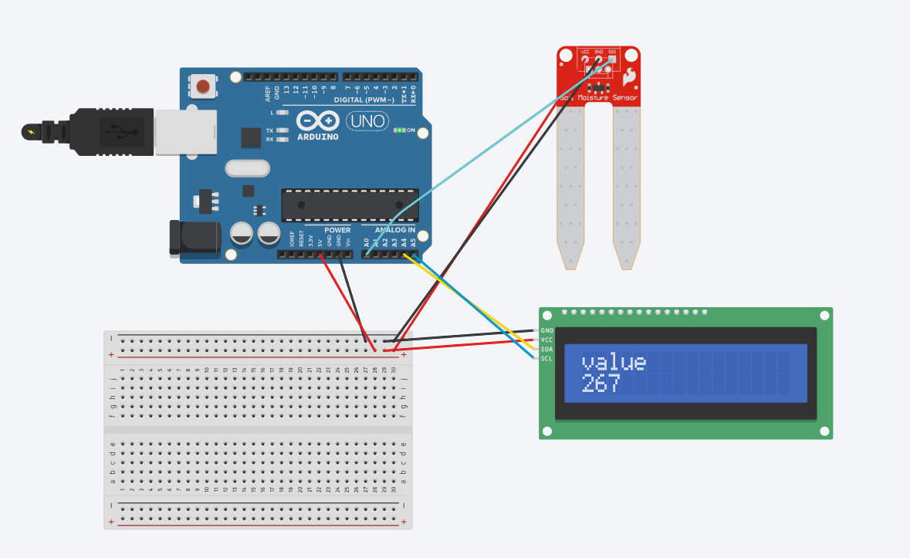

# 🌱 Soil Moisture Monitoring System

A simple Arduino-based system that reads soil moisture sensor values and displays the data in real-time on an LCD screen using I2C communication.

## 📌 Overview

This project demonstrates how environmental data (soil moisture) can be collected using a sensor and displayed instantly to the user. It serves as a basic prototype for smart agriculture and IoT-based monitoring systems.

## 🧰 Components Used

* Arduino Uno
* Soil Moisture Sensor
* 16x2 LCD Display (I2C)
* Connecting wires

## ⚙️ How It Works

* The soil moisture sensor is connected to the analog pin (A0) of the Arduino.
* The sensor continuously reads moisture levels from the soil.
* The Arduino processes this analog data.
* The value is displayed on the LCD screen in real-time.
* The display updates every second.

## 💻 Code Explanation

* `analogRead(sensor)` reads the moisture level from the sensor.
* The LCD is initialized using the `LiquidCrystal_I2C` library.
* The screen is cleared before each update to avoid overlapping text.
* The sensor value is printed on the LCD using cursor positioning.

## 📷 Output

The LCD screen displays:

* A label ("value") on the first row
* The live moisture reading on the second row

## 🚀 Future Improvements

* Add threshold-based alerts (dry / wet indication)
* Automate irrigation using a relay and water pump
* Send data to a mobile app or cloud platform
* Improve UI with percentage-based moisture display

## 📚 Learning Outcome

* Understanding of analog sensors
* Interfacing LCD with Arduino using I2C
* Real-time data display
* Basics of embedded system design

---

✨ This is a beginner-level IoT project focused on building real-world sensor-based systems.

